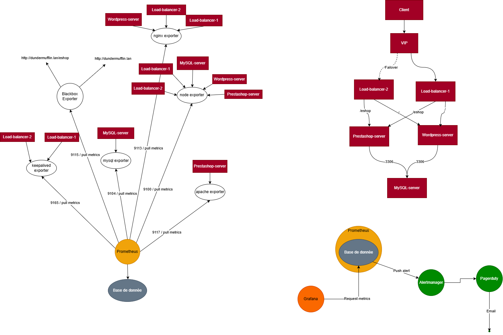

# 3MIN

Nous devons monitorer l'infrastructure Dundermifflin, pour ce faire nous utilisons des solutions open source, notamment la suite Grafana + Prometheus.
## 📦 Services utilisés

| Service                     | Description                                                             |
|-----------------------------|-------------------------------------------------------------------------|
| **Prometheus**              | Collecte les métriques via différents exporters.                        |
| **Grafana**                 | Visualisation des métriques via des dashboards.                         |
| **Node Exporter**           | Suivi des ressources système (CPU, RAM, disque).                        |
| **Blackbox Exporter**       | Vérification de la disponibilité de sites ou services via HTTP/ICMP/TCP. |
| **Keepalived Exporter**     | Suivi des états de basculement (VRRP).                                  |
| **Nginx / Apache Exporter** | Suivi des métriques des serveurs web.                                   |
| **Mysqld Exporter**         | Suivi des métriques de la base de donnée.                               |

# ✨ Prérequis

- Initialiser les targets avec les adresses IP de votre infrastructure selon l'exporter installé.

  - Exemple : ``192.168.1.10`` = ``apache_exporter`` ➜ mettre l'IP dans le fichier ``targets.apache.json``

- Rentrer dans le ``.env`` l'utilisateur et le mot de passe de Grafana.

- Pour déployer vos `` exporters`` sur vos serveurs, vous pouvez utiliser les commandes ci-dessous :
````bash
# Exemple (ajustez selon votre script)
cd exporter
./install_node_exporter.sh
./install_apache_exporter.sh
# etc.
````


⚠️ N'oubliez pas d'initialiser les variables dans les scripts, qui se trouvent dans le dossier exporter

- Pour AlertManager, configurez-le en suivant la documentation PagerDuty : https://www.pagerduty.com/docs/guides/prometheus-integration-guide/

## 🧱 Lancé le projet

L'ensemble des services est déployé via Docker Compose, lancé cette commande à la racine du projet  : 
```bash
docker compose up -d 
``` 
Les métriques sont accessibles via Prometheus, et visualisées avec Grafana sur votre pc en allant sur `localhost:3000` pour Grafana et `localhost:9090` pour Prometheus.
    
## Schéma d'infrastructure avec monitoring


## 🔄 Mise à jour

Si vous souhaitez ajouter des targets : 
````bash
docker compose down
````
Ajouter vos targets dans les JSON puis :
````bash
docker compose up -d
````